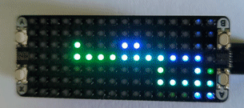

# Worms micropython demo
This is a demo for the [Pico Unicorn Pack](https://github.com/pimoroni/pimoroni-pico/tree/main/micropython/modules/pico_unicorn), using micropython to animate some colorful worms to crawl the Unicorn screen. To install, just follow tutorials such as [this one](https://learn.pimoroni.com/article/getting-started-with-pico). The final effect: 

  

This is the basic (non-W) raspberry pico 2040 with the pre-soldered headers, a unicorn hat and the diffuser from pimoroni. The diffuser did not fit so I superglued it to the four unicorn buttons. 

The code is object oriented, which makes programming for the pico much faster and way more readable over arduino code. There are 8 different worms with different behaviours, each dying over time, respawning and having a small chance of birthing another worm during it's lifetime. 

The buttons on the Unicorn have some function as well: 
* Button A adds a new worm
* Button B removes the last added worm
* Button X should slow the worms down a little
* Button Y should speed the worms up 
